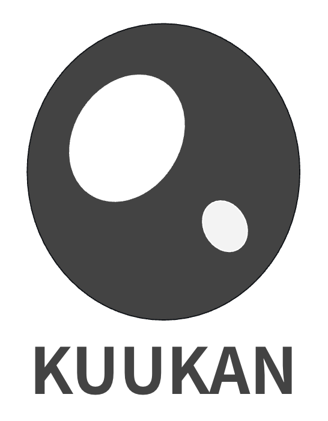

<div align="center">



# kuukan

**Abstract Functional Analysis Interfaces in C++**

[](https://github.com/yourusername/kuukan)
[](https://en.cppreference.com/w/cpp/20)
[](LICENSE)

</div>

kuukan is a header-only C++20 library that provides abstract interfaces for functional analysis concepts. It allows you to define mathematical structures (vector spaces, metric spaces, normed spaces) through "operation injection" - you provide functors that implement the operations, and the library composes them into complete mathematical structures.

## Features

- **Abstract Vector Spaces**: Define vector spaces over any element type (including infinite-dimensional spaces like function spaces)
- **Metric Spaces**: Define distance functions between elements
- **Normed Spaces**: Define norms and automatically derive metrics
- **Type-Safe**: Uses C++20 concepts for compile-time type checking
- **Header-Only**: No linking required, just include the headers
- **Zero Dependencies**: Only requires a C++20 compliant compiler

## Quick Start

### Requirements

- C++20 compliant compiler (GCC 10+, Clang 10+, MSVC 19.29+)
- CMake 3.20+ (optional, for building examples)

### Installation

kuukan is a header-only library. Simply clone the repository and add the `include` directory to your include path:

```bash
git clone https://github.com/yourusername/kuukan.git
cd kuukan
```

### Basic Usage

```cpp
#include <kuukan/kuukan.hpp>

// Define your element type
struct MyVector {
    double x, y;
};

// Define operation functors
struct VecAdd {
    MyVector operator()(const MyVector& a, const MyVector& b) const {
        return MyVector{a.x + b.x, a.y + b.y};
    }
};

struct VecScale {
    MyVector operator()(double s, const MyVector& v) const {
        return MyVector{s * v.x, s * v.y};
    }
};

// ... define other functors (Negation, ZeroSupplier, Equality)

// Create vector space
using MyVectorSpace = kuukan::VectorSpace<
    MyVector,    // Element type
    double,      // Scalar type
    VecAdd,      // Addition
    VecScale,    // Scalar multiplication
    VecNegate,   // Negation
    VecZero,     // Zero element
    VecEqual     // Equality
>;

// Use operations
MyVector v1{1, 2}, v2{3, 4};
auto sum = MyVectorSpace::addition(v1, v2);
auto scaled = MyVectorSpace::scalar_action(2.0, v1);
```

## Building Examples

The library includes example code demonstrating how to use kuukan:

```bash
mkdir build
cd build
cmake ..
make
```

To build examples:

```bash
cmake -DKUUKAN_BUILD_EXAMPLES=ON ..
make
```

The examples will be in `build/examples/`.

## Documentation

### Generating Documentation

Doxygen documentation can be generated using:

```bash
doxygen Doxyfile
```

The generated documentation will be in the `doc/` folder:
- **HTML**: `doc/html/index.html` - Open in your browser
- **LaTeX**: `doc/latex/` - For PDF generation

### Viewing Documentation

After generating, open `doc/html/index.html` in your web browser.

## Library Structure

### Core Components

- **Concepts** (`include/kuukan/concepts/core_concepts.hpp`): Type requirements
  - `FieldLike`: Scalar field concept
  - `OrderedMeasure`: Measure type for metrics/norms
  - `CallableLike`: Callable type signature checking

- **VectorSpace** (`include/kuukan/vector/vector_space.hpp`): Abstract vector space interface
  - Operation injection pattern
  - Supports infinite-dimensional spaces

- **MetricSpace** (`include/kuukan/metric/metric_space.hpp`): Abstract metric space interface
  - Distance function injection
  - Metric space axioms

- **NormedSpace** (`include/kuukan/norm/normed_space.hpp`): Normed space with induced metric
  - Extends VectorSpace with norm
  - Automatically constructs metric from norm

## Example: Function Spaces

The library excels at working with infinite-dimensional spaces like function spaces:

```cpp
// Define a function element
struct RealFunctionElement {
    std::function<double(double)> evaluator;
    std::string symbolic_identity;
};

// Define pointwise operations
struct FunctionAddition {
    RealFunctionElement operator()(
        const RealFunctionElement& f,
        const RealFunctionElement& g
    ) const {
        return RealFunctionElement{
            .evaluator = [f, g](double x) { return f.evaluator(x) + g.evaluator(x); },
            .symbolic_identity = "(" + f.symbolic_identity + " + " + g.symbolic_identity + ")"
        };
    }
};

// ... define other functors

// Create function vector space
using FunctionSpace = kuukan::VectorSpace<
    RealFunctionElement,
    double,
    FunctionAddition,
    FunctionScalarAction,
    FunctionNegation,
    FunctionZeroSupplier,
    FunctionEquality
>;

// Use with functions
RealFunctionElement sin_func{
    .evaluator = [](double x) { return std::sin(x); },
    .symbolic_identity = "sin"
};

RealFunctionElement cos_func{
    .evaluator = [](double x) { return std::cos(x); },
    .symbolic_identity = "cos"
};

auto sum = FunctionSpace::addition(sin_func, cos_func);
```

See `examples/minimal_function_space.cpp` for a complete example.

## Operation Injection Pattern

kuukan uses an "operation injection" pattern where you provide functors implementing the mathematical operations rather than requiring operators on element types. This approach:

- Works with types you don't control (e.g., `std::function`)
- Allows multiple vector space structures over the same element type
- Supports symbolic or lazy evaluation without modifying element types
- Maintains abstraction without assuming finite dimensions

## Mathematical Concepts

### Vector Space Axioms

Your operation functors must satisfy:
- **Addition**: Associative, commutative, with identity (zero)
- **Scalar Multiplication**: Distributive over addition and field addition
- **Negation**: Each element has an additive inverse
- **Zero**: There exists a unique zero element

### Metric Space Axioms

Your distance function must satisfy:
- **Non-negativity**: distance(a, b) ≥ 0
- **Identity of indiscernibles**: distance(a, b) = 0 ⟺ a = b
- **Symmetry**: distance(a, b) = distance(b, a)
- **Triangle inequality**: distance(a, c) ≤ distance(a, b) + distance(b, c)

### Norm Axioms

Your norm function must satisfy:
- **Non-negativity**: norm(v) ≥ 0
- **Definiteness**: norm(v) = 0 ⟺ v = 0
- **Absolute homogeneity**: norm(α·v) = |α|·norm(v)
- **Triangle inequality**: norm(u + v) ≤ norm(u) + norm(v)

## Integration with CMake

If you're using CMake in your project, you can integrate kuukan:

```cmake
# Add kuukan as a subdirectory or find it
add_subdirectory(path/to/kuukan)

# Link to your target
target_link_libraries(your_target PRIVATE kuukan::kuukan)
```

## License

This project is licensed under the MIT License - see the [LICENSE](LICENSE) file for details.

## Contributing

Contributions are welcome! Please feel free to submit a Pull Request.

## Acknowledgments

- Designed for C++20 concepts and modern C++ practices
- Inspired by functional analysis and abstract algebra
- Built with type safety and zero-overhead abstractions in mind

